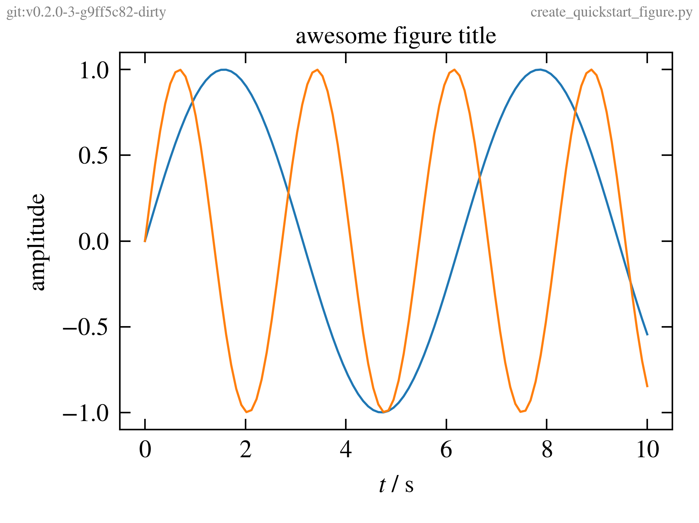

# figure-tools
A small Python package for setting up a consistent workflow for creating images in scientific publications with matplotlib and with research data management (RDM) in mind.

## Installation

> Currently the library is not in the PyPi package index.

Install the package using `pip`

```shell
pip install git+https://github.com/thaeber/figure-tools.git#egg=figure-tools
```

or `conda`, by utilizing the pip support in the `environment.yml` file:

```yaml
name: <env-name>
channels:
  - defaults
dependencies:
  - python
  - pip
  # list of additional packages
  # ...
  # ...
  - pip:
      - git+https://github.com/thaeber/figure-tools.git#egg=figure-tools
```

## Quickstart

> We assume that all scripts for creating the figures are managed in
> a git repository to help in research data management. The `git` executable
> must be reachable through the `PATH` environment variable.

Creating and saving figures always follows the same workflow:

```python
import numpy as np
import matplotlib.pyplot as plt
from figure_tools import apply_style, create_figure, save_figure

# Apply a common style and figure size. For example, the default
# figure size might be valid for a single column figure in a journal.
apply_style()

# Create a new figure that is one column wide (1x) and has 
# the default height.
fig = create_figure(width='1x')

# ... put your own plotting logic here
# ...
# ...
x = np.linspace(0, 10, 100)
plt.plot(x, np.sin(x), '-')
plt.plot(x, np.sin(2.3 * x), '-')
plt.xlabel('$t$ / s')
plt.ylabel('amplitude')
# ...
# ...
# ...

plt.tight_layout()

# Save the current figure in "png" format. The image will have the same
# name as the python script, except for another suffix.
save_figure(__file__)
```

This will create the following figure:



By default the package will add the git tag and commit hash (as obtained by `git describe --always`) as well as the script name (the `__file__` parameter above) to the figure as annotation (see top-left and top-right corners). This behavior can be configured by environment variables.

The same information is passed to the `metadata` parameter of [`fig.savefig`](https://matplotlib.org/api/_as_gen/matplotlib.pyplot.savefig.html?highlight=savefig#matplotlib.pyplot.savefig), so it can be retrieved later, e.g. with the [pillow](https://github.com/python-pillow/Pillow) package and the [`Image.info`](https://pillow.readthedocs.io/en/stable/handbook/concepts.html#info) field. Additionally, the metadata contains the output of `git blame` for the script file, so that the changes made to the figure can be traced back to the individual commits. The `load_image_metadata` and `print_image_metadata` functions can be used to load or directly output the metadata. Internally the functions use the `Image.info` field of the `pillow` package. The output of `print_image_metadata` for the above image yields:

```yaml
       Software: Matplotlib version3.3.2, https://matplotlib.org/
        created: 2020-10-21 12:32:33.083226+00:00
     git-commit: v0.2.0-1-gca2bc9d-dirty
script-filename: create_quickstart_figure.py
      git-blame: ca2bc9df (thaeber           2020-10-21 14:29:39 +0200  1) #%%
                 ca2bc9df (thaeber           2020-10-21 14:29:39 +0200  1) #%%
                 ca2bc9df (thaeber           2020-10-21 14:29:39 +0200  2) import numpy as np
                 ca2bc9df (thaeber           2020-10-21 14:29:39 +0200  3) import matplotlib.pyplot as plt
                 ca2bc9df (thaeber           2020-10-21 14:29:39 +0200  4) from figure_tools import apply_style, create_figure, save_figure
                 ca2bc9df (thaeber           2020-10-21 14:29:39 +0200  5) 
                 ca2bc9df (thaeber           2020-10-21 14:29:39 +0200  6) # %%
                 ca2bc9df (thaeber           2020-10-21 14:29:39 +0200  7) apply_style()
                 ca2bc9df (thaeber           2020-10-21 14:29:39 +0200  8) 
                 ca2bc9df (thaeber           2020-10-21 14:29:39 +0200  9) # %%
                 00000000 (Not Committed Yet 2020-10-21 14:32:33 +0200 10) fig = create_figure(width='1x')
                 ca2bc9df (thaeber           2020-10-21 14:29:39 +0200 11) 
                 ca2bc9df (thaeber           2020-10-21 14:29:39 +0200 12) # ... put your own plotting logic here
                 ca2bc9df (thaeber           2020-10-21 14:29:39 +0200 13) # ...
                 ca2bc9df (thaeber           2020-10-21 14:29:39 +0200 14) # ...
                 ca2bc9df (thaeber           2020-10-21 14:29:39 +0200 15) x = np.linspace(0, 10, 50)
                 00000000 (Not Committed Yet 2020-10-21 14:32:33 +0200 16) plt.plot(x, np.sin(x), '.-')
                 00000000 (Not Committed Yet 2020-10-21 14:32:33 +0200 17) plt.plot(x, np.sin(2.3 * x), '.-')
                 00000000 (Not Committed Yet 2020-10-21 14:32:33 +0200 18) plt.xlabel('$t$ / s')
                 00000000 (Not Committed Yet 2020-10-21 14:32:33 +0200 19) plt.ylabel('amplitude')
                 ca2bc9df (thaeber           2020-10-21 14:29:39 +0200 20) # ...
                 ca2bc9df (thaeber           2020-10-21 14:29:39 +0200 21) # ...
                 ca2bc9df (thaeber           2020-10-21 14:29:39 +0200 22) # ...
                 ca2bc9df (thaeber           2020-10-21 14:29:39 +0200 23) 
                 ca2bc9df (thaeber           2020-10-21 14:29:39 +0200 24) plt.tight_layout()
                 ca2bc9df (thaeber           2020-10-21 14:29:39 +0200 25) 
                 ca2bc9df (thaeber           2020-10-21 14:29:39 +0200 26) # Save the current figure in "png" format. The image will have the same
                 ca2bc9df (thaeber           2020-10-21 14:29:39 +0200 27) # name as the python script, except for another suffix.
                 ca2bc9df (thaeber           2020-10-21 14:29:39 +0200 28) save_figure(__file__)
                 ca2bc9df (thaeber           2020-10-21 14:29:39 +0200 29) 
                 ca2bc9df (thaeber           2020-10-21 14:29:39 +0200 30) # %%
            dpi: (600, 600)
```

## Styling {#styling}

> ... work in progress (see #6). Currently an internal style sheet is used.

Call `apply_style()` to set the matplotlib styling parameters to a common style that also includes a common base figure size for all figures in the project.

## Creating figures

`create_figure()` is a convenience function for creating figures. Internally it is just a wrapper around the [`pyplot.figure()`](https://matplotlib.org/api/_as_gen/matplotlib.pyplot.figure.html?highlight=figure#matplotlib-pyplot-figure) function, but it simplifies the creation of figures with similar size constraints. For example, publications in scientific journals are often printed in two-columns. If the [style file](#styling) defines the with and height of a single-column wide figure then creating a double-column wide figure with the same height is as easy as calling:

```python
fig = create_figure(width='2x')
```

There is no need to remember the physical size of a double-colum wide figure, if the base size is configured appropriately. The width parameter can be any multiple of the base figure width, followed by an 'x', e.g. '1.25x'. The figure height can be specified in the same way using the `height` parameter. 

`create_figure` also provides an `aspect_ratio` parameter to create figures with a given width and aspect ratio (height/width). The `aspect_ratio` is ignored if the `height` parameter is present. To create a single-column wide figure with an aspect ratio of $1.0$ call:

```python
fig = create_figure(width='1x', aspect_ratio=1.0)
```

The width and height parameters are not constrained to multiples or fractions of the base figure size. It is also possible to specify the absolute size of the images in physical units, which consists of a number followed by one of the supported length units (cm, mm, inch). Examples:

```python
# create figure that is 8cm wide and 60mm high
fig = create_figure(width='8cm', height='60mm')

# create a figure that is 8cm wide with an aspect ratio of 1.0,
# so that the final height will also be 8cm
fig = create_figure(width='8cm', aspect_ratio=1.0)

# create a figure with a size of 3-by-2 inches
fig = create_figure(width='3inch', height='2inch')
```

`float` values passed to the `width` and `height` parameters are passed directly to the `figsize` parameter of the `pyplot.figure()` call, thus representing the size of the figure in inches, the internal length unit of matplotlib.

